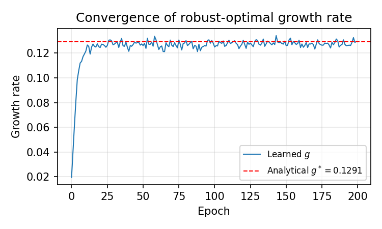
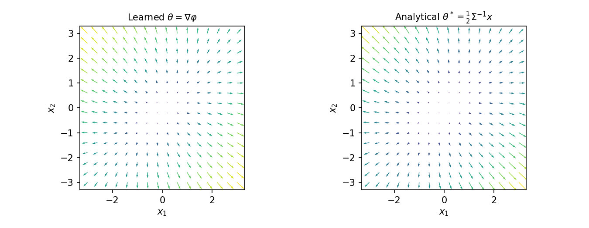

# Robust maximisation of asymptotic growth

This repository contains the analytical and numerical work for the *Mathematics for New Technologies in Finance* mini-project on robust portfolio growth under drift uncertainty.

The project studies a minimax problem in which an investor chooses a functionally generated strategy while an adversary changes the drift of a multidimensional Ornstein-Uhlenbeck process without changing its stationary Gaussian distribution. The analytical solution is used as a benchmark for adversarial neural-network training.

## Main result

For stationary covariance

```text
Sigma = [[1.0, 0.3],
         [0.3, 1.0]]
```

and instantaneous covariance

```text
c = [[0.5, 0.1],
     [0.1, 0.5]]
```

the analytical robust-optimal strategy and growth rate are

```text
theta*(x) = (1/2) Sigma^(-1) x
g*        = (1/8) Tr(c Sigma^(-1)) = 0.1291.
```

The submitted experiment reported a learned growth rate of approximately
`0.1303`. A fresh end-to-end run of the repository version obtained `0.129445`,
about 0.25% from the analytical benchmark, and recovered the same linear
strategy up to Monte Carlo and approximation error.





## Repository contents

```text
.
├── README.md
├── requirements.txt
├── docs/
│   ├── assignment.pdf       # original three-page project brief
│   ├── assignment.txt       # accessible plain-text version
│   ├── original_code.py     # original submitted script, unchanged
│   ├── report.pdf           # submitted two-page report
│   ├── report.txt           # expanded plain-text derivation
│   └── submitted_results/   # original submitted figures, unchanged
├── results/
│   ├── growth_rate_convergence.png
│   ├── strategy_comparison.png
│   └── metrics.json         # verified full-run settings and outputs
├── src/
│   └── robust_growth.py     # analytical benchmark and adversarial training
└── tests/
    └── test_core.py         # deterministic mathematical checks
```

## Reproduce the experiment

Python 3.10 or newer is recommended. A CPU-only run is sufficient.

```bash
python3 -m venv .venv
source .venv/bin/activate
python -m pip install --upgrade pip
python -m pip install -r requirements.txt
python src/robust_growth.py
```

The full command uses the submitted hyperparameters (`200` epochs and seed `42`) and writes the figures plus a machine-readable `metrics.json` file to `results/`.

For a short installation and pipeline check:

```bash
python src/robust_growth.py --quick --output-dir /tmp/robust-growth-smoke
```

Useful options can be listed with:

```bash
python src/robust_growth.py --help
```

## Run the tests

The test suite uses Python's standard library, so it needs no additional test dependency:

```bash
python -m unittest discover -s tests -v
```

The checks cover the closed-form growth rate and the Lyapunov/Fokker-Planck constraint used to parameterise the adversary.

## Method

The agent is a smooth multilayer perceptron representing the generating function `phi`. PyTorch automatic differentiation produces the strategy `theta = grad(phi)` and the Hessian term in the growth functional. The adversary controls the degrees of freedom in the OU drift matrix

```text
B = (1/2) c Sigma^(-1) + A Sigma^(-1),
```

where `A` is skew-symmetric. This construction enforces

```text
B Sigma + Sigma B^T = c
```

exactly, keeping the prescribed Gaussian distribution stationary throughout training. Agent and adversary are then updated with alternating gradient ascent and descent.

The complete derivation, training discussion, and comparison are in the [report](docs/report.pdf). The original task is included as [assignment.pdf](docs/assignment.pdf).

## Reproducibility notes

- NumPy and PyTorch are seeded with `42` by default.
- Matplotlib uses a non-interactive backend, so the script also runs on headless machines.
- The plots and metrics in `results/` come from a verified full run of the
  repository version; the submitted plots are archived unchanged in
  `docs/submitted_results/`.
- `src/robust_growth.py` preserves the method while adding a CLI, validation,
  metrics output, and the missing gradient connection from simulated states to
  the adversary; `docs/original_code.py` is retained for provenance.
- The drift objective is theoretically invariant along the adversary's free
  direction. Its learned `alpha` can therefore move under finite-sample noise
  without changing the robust growth-rate conclusion.
- Exact last-decimal results can vary across PyTorch versions and hardware because training uses Monte Carlo simulation.

## Reference

David Itkin, Benedikt Koch, Martin Larsson, and Josef Teichmann, “Ergodic robust maximization of asymptotic growth with stochastic factor processes,” *Finance and Stochastics* (2022), [arXiv:2211.15628](https://arxiv.org/abs/2211.15628).
